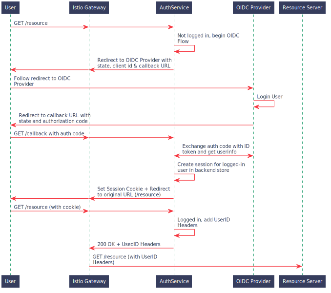

# OIDC AuthService

This is a rewrite of the [ambassador-oidc-authservice](https://github.com/ajmyyra/ambassador-auth-oidc) project.

An AuthService is an HTTP Server that an API Gateway (eg Ambassador, Envoy) asks if an incoming request is authorized.

For more information, see [this article](https://journal.arrikto.com/kubeflow-authentication-with-istio-dex-5eafdfac4782).

## OpenID Connect

[OpenID Connect (OIDC)](http://openid.net/connect/) is an authentication layer on top of the OAuth 2.0 protocol. As OAuth 2.0 is fully supported by OpenID Connect, existing OAuth 2.0 implementations work with it out of the box.

Currently it only supports OIDC's [Authorization Code Flow](http://openid.net/specs/openid-connect-basic-1_0.html#CodeFlow), similar to OAuth 2.0 Authorization Code Grant.

## Sequence Diagram for an Authentication Flow

## Options

Following environment variables are used by the software.

**Compulsary**
* **OIDC_PROVIDER** URL to your OIDC provider, for example: https://you.eu.auth0.com/
* **REDIRECT_URL** The URL that the OIDC provider will send the auth_code to. Also called callback URL. This should be in the form of: `<client_url>/login/oidc`.
* **OIDC_SCOPES** OIDC scopes wanted for userinfo, for example: "profile email".
* **CLIENT_ID** Client id for your application (given by your OIDC provider).
* **CLIENT_SECRET** Client secret for your application.

**Optional**
* **PORT** Port to listen for requests. Default is 8080.
* **SKIP_AUTH_URI** Space separated whitelist of URIs like "/info /health" to bypass authorization. Contains nothing by default.
  **WARNING:** Make sure that the path in SKIP_AUTH_URI matches the path in the VirtualService definition of your Service Mesh. If it doesn't (eg you whitelist /dex and you match /dex/ in the VirtualService) you could leave resources exposed! (in this example, the /dex path is exposed)
  
OIDC-AuthService stores sessions and other state in a local file using BoltDB.
Other stores will be added soon.

OIDC AuthService can add extra headers based on the userid that was detected.
Applications can then use those headers to identify the user.

* **USERID_CLAIM** The claim whose value will be used as the userid (default `email`).
* **USERID_HEADER** The name of the header containing the userid (default `kubeflow-userid`).
* **USERID_TOKEN_HEADER** The name of the header containing the id_token. (default `kubeflow-userid-token`).
* **USERID_PREFIX** The prefix added to the userid, which will be the value of the header.

## Usage

OIDC-Authservice is an OIDC Client, which authenticates users with an OIDC Provider and assigns them a session.
Can be used with:
* Ambassador with AuthService
* Envoy with the ext_authz Filter
* Istio with EnvoyFilter, specifying ext_authz

### Build

* Local: `make build`
* Docker: `make docker-build`

# E2E Tests

For the E2E tests, we setup build the AuthService and run it along with an OIDC Provider (Dex) as Docker containers.
Then, we issue requests to confirm we get the functionality we expect.
